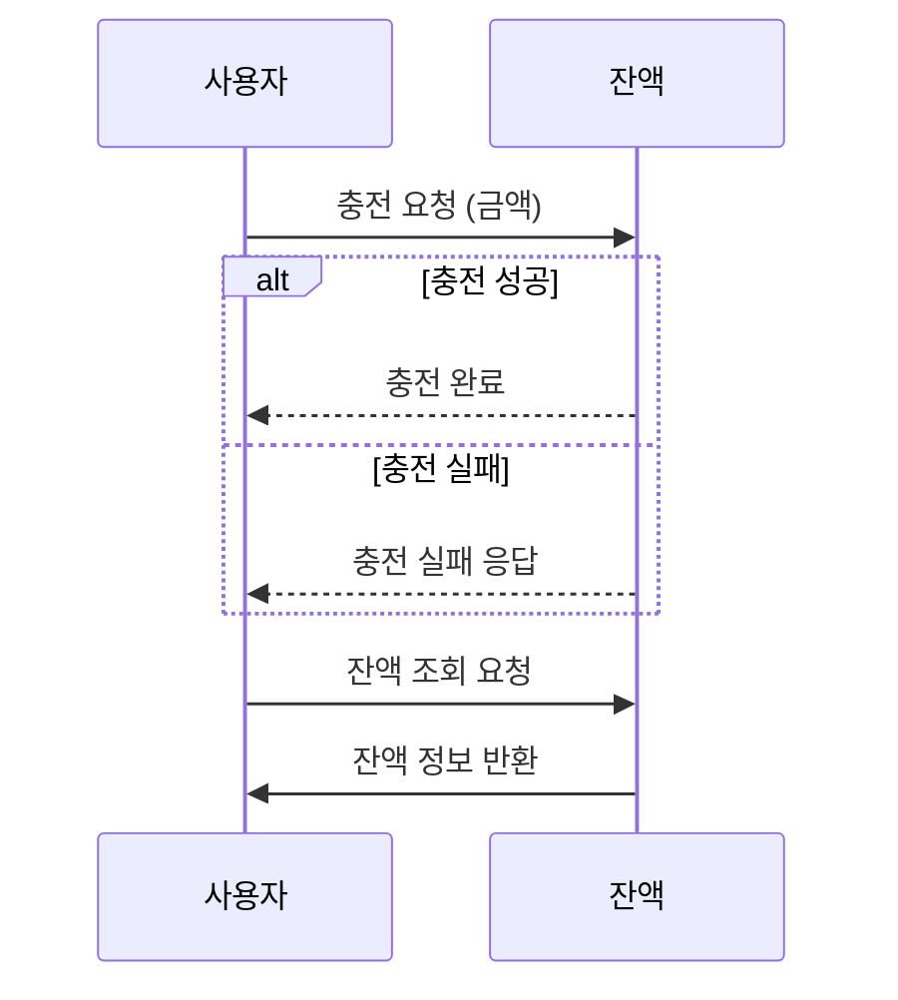
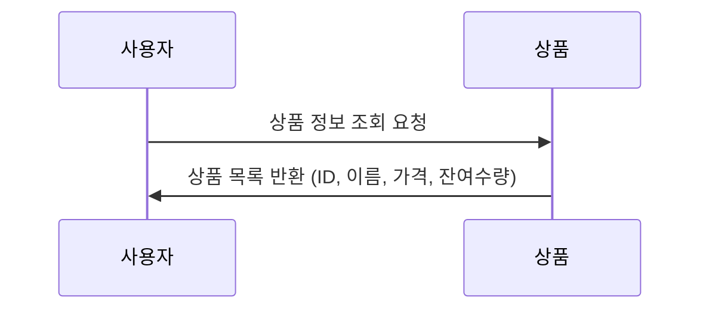
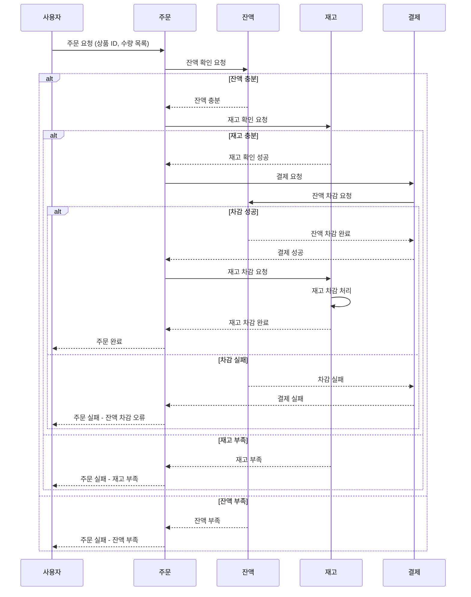
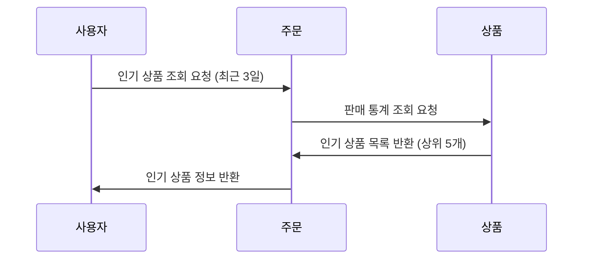
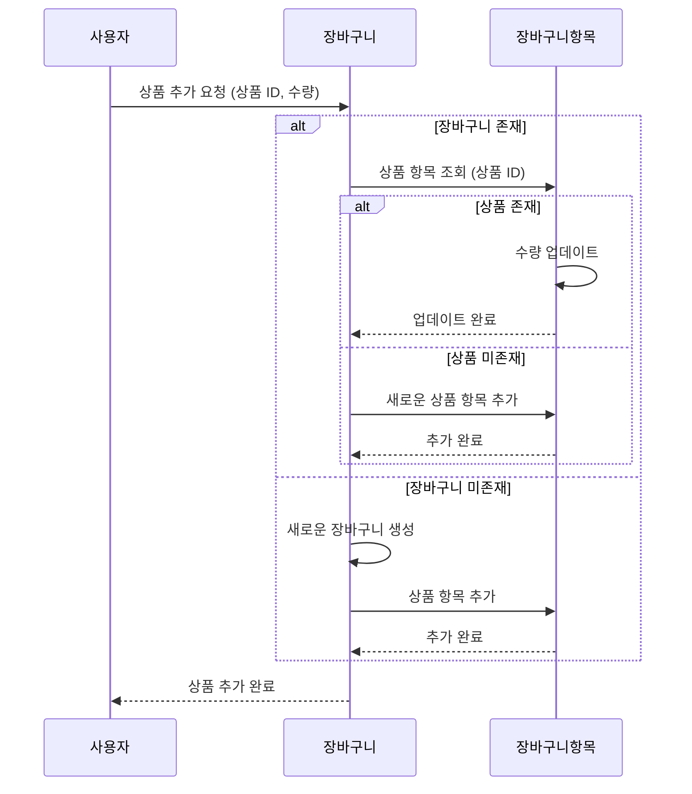
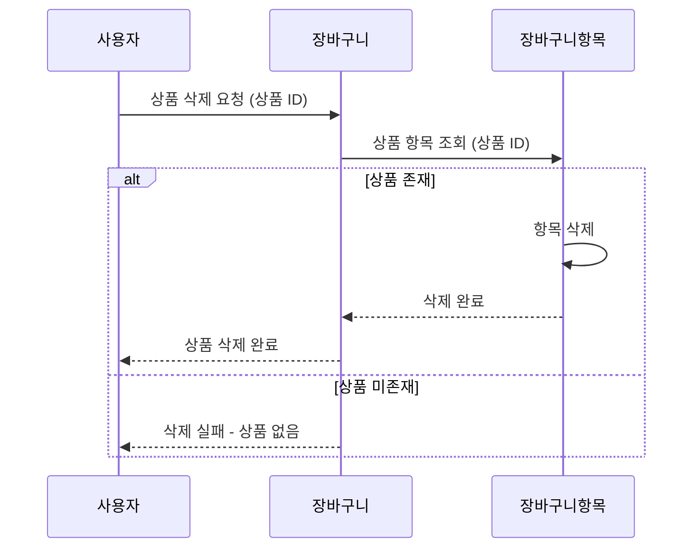
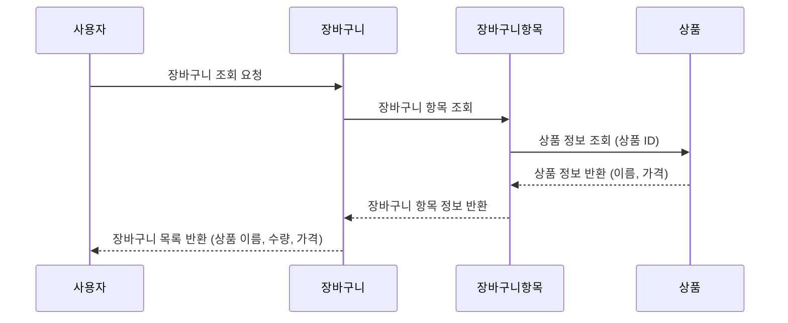
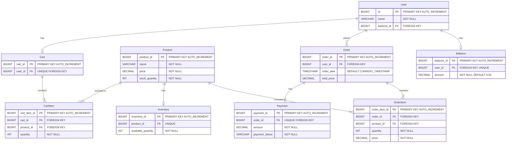

# E-commerce 서버 구축

## 프로젝트 문서 

  
<b>프로젝트 Milestone</b>

<a href="https://github.com/users/onetaek/projects/4/views/1">
    
<a/>

- github의 project 와 milestones 기능을 사용하여 작성하였습니다.
- 이미지를 클릭하시면 자세한 내용을 확인할 수 있습니다.

  
<b>도메인 모델링</b>

<a href="https://lucid.app/lucidchart/c90bb540-962e-46a2-b01a-c3a065a2714e/edit?viewport_loc=-1053%2C-547%2C2367%2C1030%2C0_0&invitationId=inv_0471bdc9-2ac0-4a1f-99e6-2adcd636f258">
    
<a/>
- 요구사항에 맞는 어떤 `객체`를 도출해낼 것인가? 어떤 `메세지`를 전달할 것인가? 를 생각하며 모델링 하였습니다.

  
<b>시퀀스 다이어그램</b>

1. 잔액 충전 / 조회 시나리오

2. 상품 조회 시나리오

3. 주문 / 결제 시나리오

4. 인기 판매 상품 조회 시나리오

5-1. 장바구니에 상품 추가

5-2. 장바구니에서 상품 삭제

5-3. 장바구니 조회

  
<b>ERD</b>

## ERD

