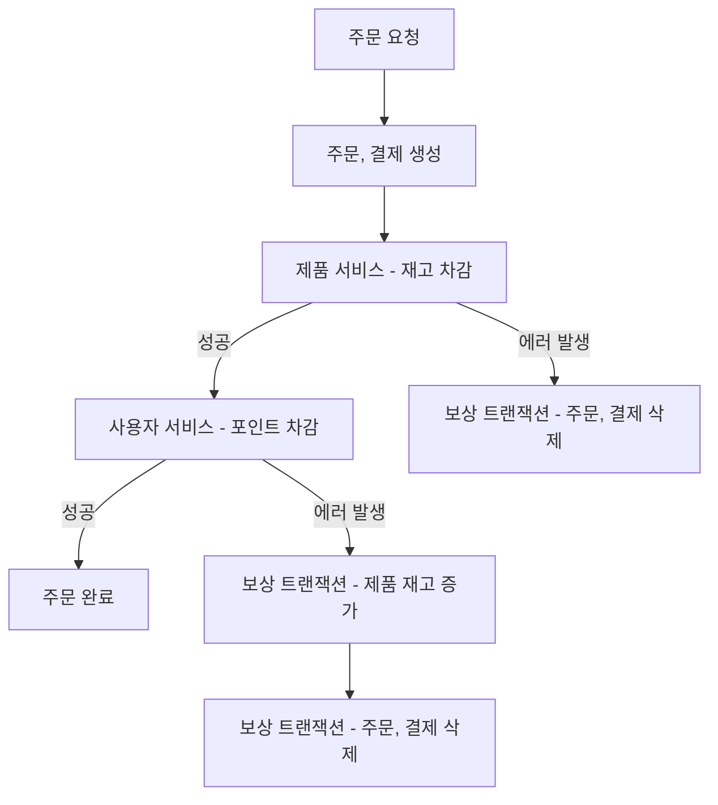
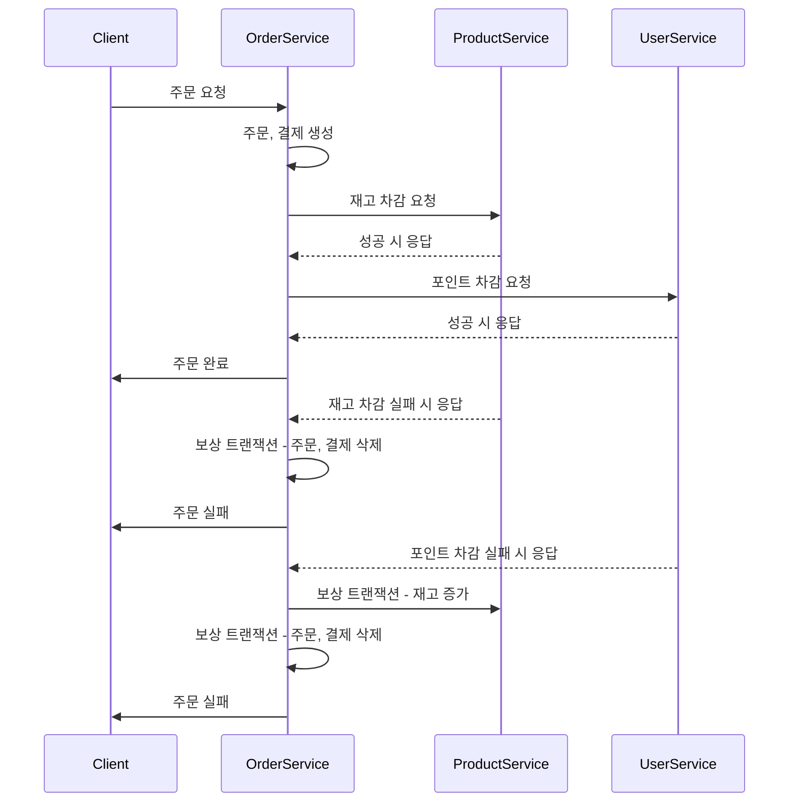

## 서비스 규모가 확장되었을 때 서비스 분리

- 서비스 규모가 확장된다면 `MSA`로 구성해야할 것입니다. 이 때 도메인을 적절하게 분리하여하여야 합니다.
- 저는 `주문`, `상품`, `사용자` 3가지 도메인으로 서비스를 분리하여 설계하였습니다.
- 부가적인 서비스로 `Eureka Server`, `API Gateway`, `Config Server`, `모니터링 서비스`가 있습니다.
  - `Eureka Server` : 각 마이크로서비스가 자신을 등록하고 다른 서비스들을 발견하도록 돕는 서비스 레지스트리.
  - `API Gateway` : 클라이언트 요청을 각 서비스로 라우팅하고 부하 분산, 인증 등의 기능을 제공.
  - `Config Server` : 모든 마이크로서비스의 설정을 중앙에서 관리하는 서버.
  - `모니터링` : 프로메테우스 + 그라파나를 활용한 모니터링 시스템.

## 📌 분산 트랜잭션: SAGA 패턴의 선택
- MSA에서는 분산 트랜잭션을 처리할 때 2PC(Two-Phase Commit)와 SAGA 패턴을 고려합니다.
- `2PC`: 강한 일관성을 보장하지만 복잡도가 높고 성능 문제가 있을 수 있습니다.
- `SAGA 패턴`: 서비스 간 트랜잭션을 연속적인 단계로 나누어 관리하며, 시스템의 유연성과 확장성을 높이는 데 더 적합합니다.
- 이러한 이유로 `SAGA 패턴을 선택`하여 트랜잭션 관리를 효율적으로 처리하고자 합니다.

## 📌 Choreography vs Orchestration
- SAGA 패턴의 구현 방식에는 `Choreography`와 `Orchestration`이 있습니다.
- `Choreography 방식`: 각 서비스가 이벤트를 직접 처리.
- `Orchestration 방식`: 중앙 컨트롤러가 모든 트랜잭션 단계를 조정.
- 이번 프로젝트에서는 `서비스 간의 결합도를 낮추고` `유연성을 확보`하기 위해 `Choreography 방식을 채택`하였습니다.

## 📌 아웃박스 패턴의 선택 이유
- 아웃박스 패턴은 트랜잭션 내에서 이벤트와 데이터를 함께 저장하여 데이터 일관성을 유지하는 데 유용합니다.
- 이를 통해 서비스 간의 `비동기 통신을 구현`할 때 `데이터 손실`이나 `불일치를 방지`할 수 있습니다.
- 따라서 데이터 `일관성`과 `안정성`을 보장하기 위해 `아웃박스 패턴을 선택`하였습니다.

## 📌 에러발생시 보상 트랜잭션

- MSA 환경에서는 각 서비스가 독립적으로 운영되기 때문에 `하나의 트랜잭션`으로 모든 작업을 `관리하기 어렵습니다`.
- 따라서 프로세스를 진행하는 도중 `에러가 발생`하면, 이미 진행된 작업을 원래 상태로 되돌리기 위해 `보상 트랜잭션`을 수행해야 합니다.
- 보상 트랜잭션은 `이전에 성공했던 작`업을 `취소하는 방식`으로, `데이터의 일관성을 유지`합니다. 이를 통해 서비스 간의 트랜잭션 실패에 대비하여 전체 프로세스가 일관성을 유지할 수 있습니다.

