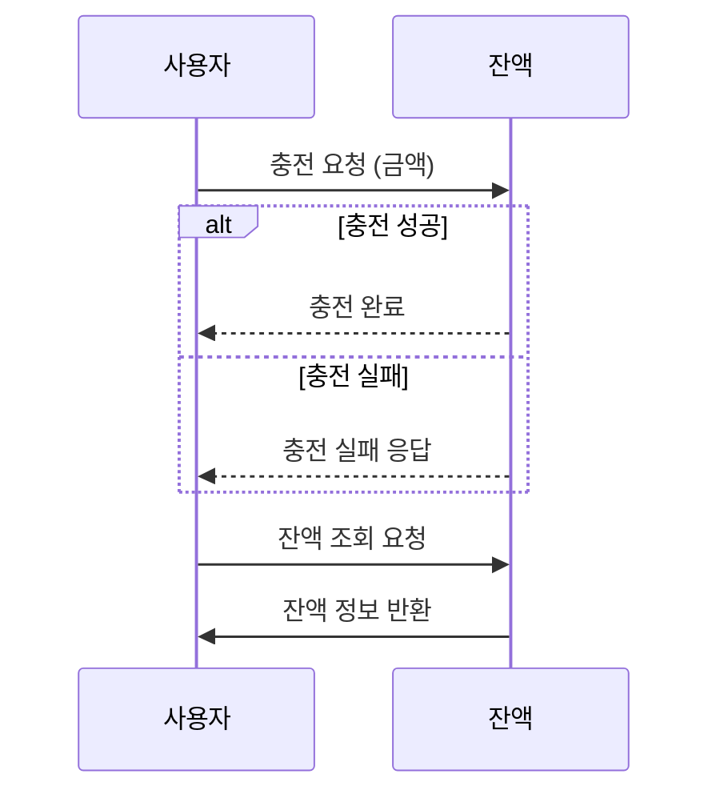
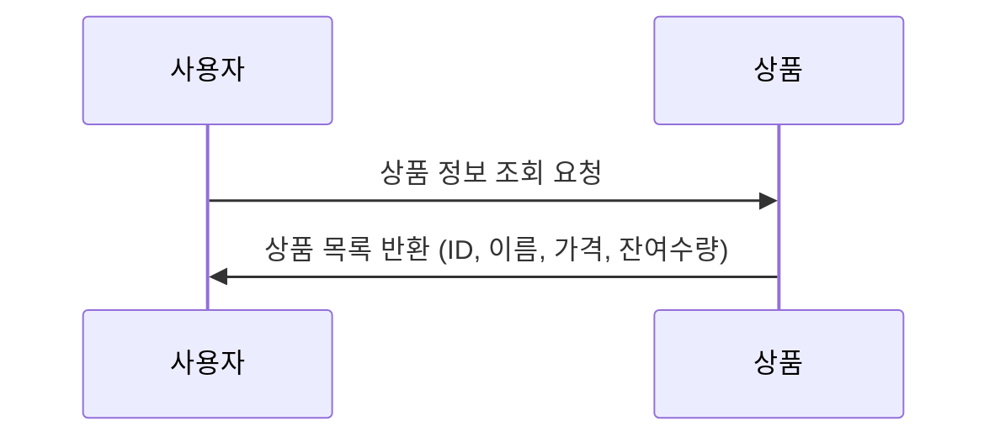
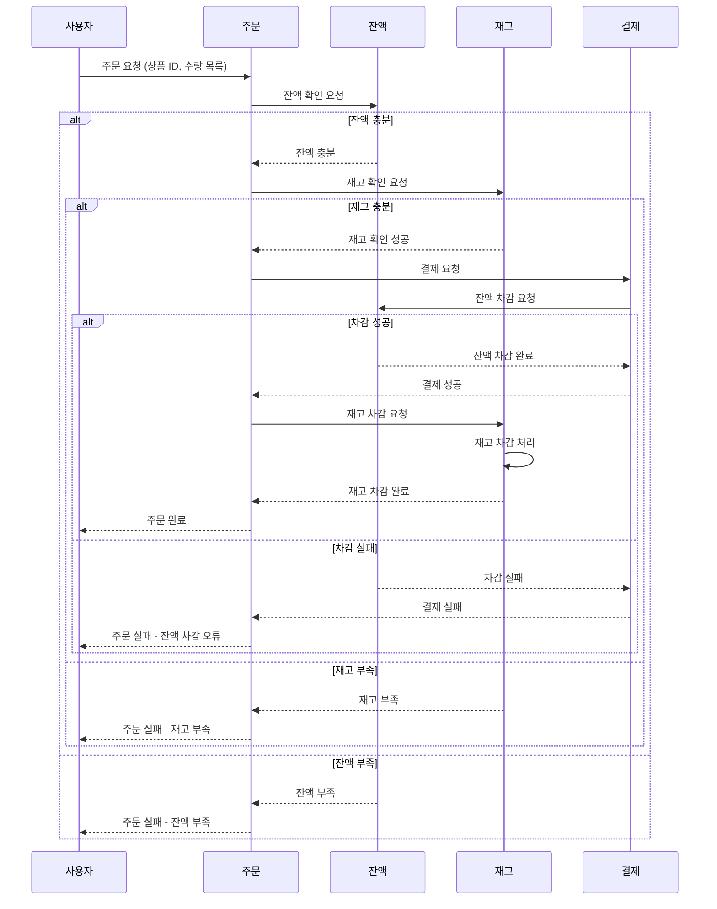
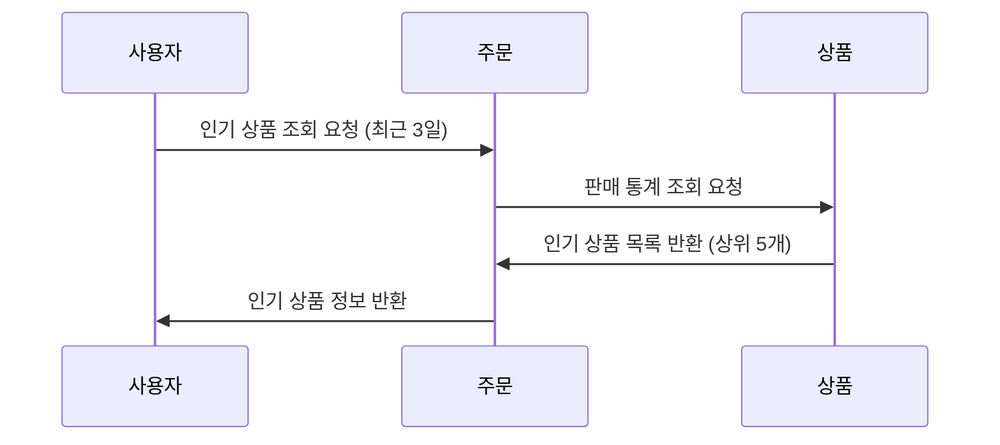
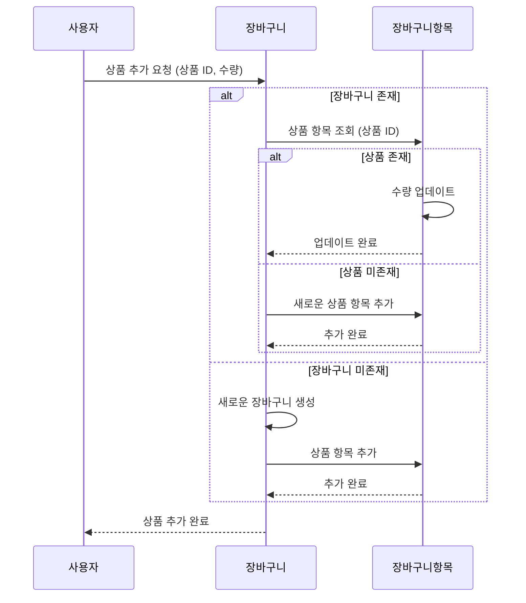
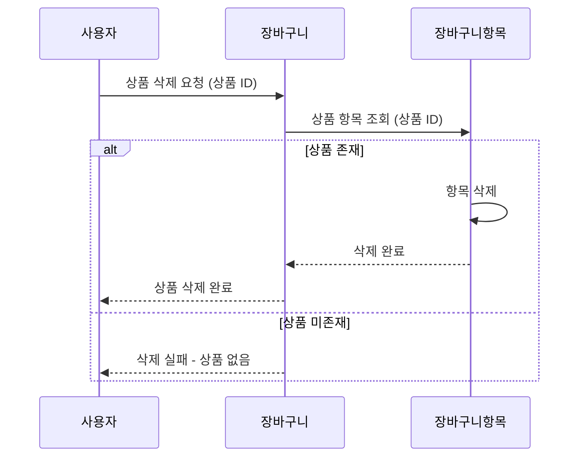
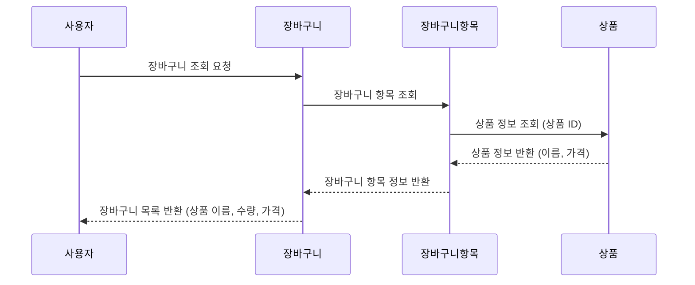

<h1>시퀀스 다이어그램</h1>

1. 잔액 충전 / 조회 시나리오

```mermaid
sequenceDiagram
    participant 사용자
    participant 잔액
    사용자 ->> 잔액: 충전 요청 (금액)
    alt 충전 성공
        잔액 -->> 사용자: 충전 완료
    else 충전 실패
        잔액 -->> 사용자: 충전 실패 응답
    end

    사용자 ->> 잔액: 잔액 조회 요청
    잔액 ->> 사용자: 잔액 정보 반환
```

2. 상품 조회 시나리오

```mermaid
sequenceDiagram
    participant 사용자
    participant 상품
    사용자 ->> 상품: 상품 정보 조회 요청
    상품 ->> 사용자: 상품 목록 반환 (ID, 이름, 가격, 잔여수량)
```

3. 주문 / 결제 시나리오

```mermaid
sequenceDiagram
    participant 사용자
    participant 주문
    participant 잔액
    participant 재고
    participant 결제
    사용자 ->> 주문: 주문 요청 (상품 ID, 수량 목록)
    주문 ->> 잔액: 잔액 확인 요청
    alt 잔액 충분
        잔액 -->> 주문: 잔액 충분
        주문 ->> 재고: 재고 확인 요청
        alt 재고 충분
            재고 -->> 주문: 재고 확인 성공
            주문 ->> 결제: 결제 요청
            결제 ->> 잔액: 잔액 차감 요청
            alt 차감 성공
                잔액 -->> 결제: 잔액 차감 완료
                결제 -->> 주문: 결제 성공
                주문 ->> 재고: 재고 차감 요청
                재고 ->> 재고: 재고 차감 처리
                재고 -->> 주문: 재고 차감 완료
                주문 -->> 사용자: 주문 완료
            else 차감 실패
                잔액 -->> 결제: 차감 실패
                결제 -->> 주문: 결제 실패
                주문 -->> 사용자: 주문 실패 - 잔액 차감 오류
            end
        else 재고 부족
            재고 -->> 주문: 재고 부족
            주문 -->> 사용자: 주문 실패 - 재고 부족
        end
    else 잔액 부족
        잔액 -->> 주문: 잔액 부족
        주문 -->> 사용자: 주문 실패 - 잔액 부족
    end

```

4. 인기 판매 상품 조회 시나리오

```mermaid
sequenceDiagram
    participant 사용자
    participant 주문
    participant 상품
    사용자 ->> 주문: 인기 상품 조회 요청 (최근 3일)
    주문 ->> 상품: 판매 통계 조회 요청
    상품 ->> 주문: 인기 상품 목록 반환 (상위 5개)
    주문 ->> 사용자: 인기 상품 정보 반환
```

5-1. 장바구니에 상품 추가

```mermaid
sequenceDiagram
    participant 사용자
    participant 장바구니
    participant 장바구니항목
    사용자 ->> 장바구니: 상품 추가 요청 (상품 ID, 수량)
    alt 장바구니 존재
        장바구니 ->> 장바구니항목: 상품 항목 조회 (상품 ID)
        alt 상품 존재
            장바구니항목 ->> 장바구니항목: 수량 업데이트
            장바구니항목 -->> 장바구니: 업데이트 완료
        else 상품 미존재
            장바구니 ->> 장바구니항목: 새로운 상품 항목 추가
            장바구니항목 -->> 장바구니: 추가 완료
        end
    else 장바구니 미존재
        장바구니 ->> 장바구니: 새로운 장바구니 생성
        장바구니 ->> 장바구니항목: 상품 항목 추가
        장바구니항목 -->> 장바구니: 추가 완료
    end
    장바구니 -->> 사용자: 상품 추가 완료

```

5-2. 장바구니에서 상품 삭제

```mermaid
sequenceDiagram
    participant 사용자
    participant 장바구니
    participant 장바구니항목
    사용자 ->> 장바구니: 상품 삭제 요청 (상품 ID)
    장바구니 ->> 장바구니항목: 상품 항목 조회 (상품 ID)
    alt 상품 존재
        장바구니항목 ->> 장바구니항목: 항목 삭제
        장바구니항목 -->> 장바구니: 삭제 완료
        장바구니 -->> 사용자: 상품 삭제 완료
    else 상품 미존재
        장바구니 -->> 사용자: 삭제 실패 - 상품 없음
    end

```

5-3. 장바구니 조회

```mermaid
sequenceDiagram
    participant 사용자
    participant 장바구니
    participant 장바구니항목
    participant 상품
    사용자 ->> 장바구니: 장바구니 조회 요청
    장바구니 ->> 장바구니항목: 장바구니 항목 조회
    장바구니항목 ->> 상품: 상품 정보 조회 (상품 ID)
    상품 -->> 장바구니항목: 상품 정보 반환 (이름, 가격)
    장바구니항목 -->> 장바구니: 장바구니 항목 정보 반환
    장바구니 -->> 사용자: 장바구니 목록 반환 (상품 이름, 수량, 가격)
```