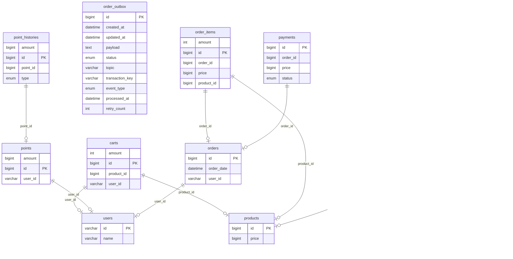

<h1>ERD</h1>

```mermaid
erDiagram
    carts {
        int amount
        bigint id PK
        bigint product_id
        varchar user_id
    }

    order_items {
        int amount
        bigint id PK
        bigint order_id
        bigint price
        bigint product_id
    }

    order_outbox {
        bigint id PK
        datetime created_at
        datetime updated_at
        text payload
        enum status
        varchar topic
        varchar transaction_key
        enum event_type
        datetime processed_at
        int retry_count
    }

    orders {
        bigint id PK
        datetime order_date
        varchar user_id
    }

    payments {
        bigint id PK
        bigint order_id
        bigint price
        enum status
    }

    point_histories {
        bigint amount
        bigint id PK
        bigint point_id
        enum type
    }

    points {
        bigint amount
        bigint id PK
        varchar user_id
    }

    product_inventories {
        int amount
        bigint id PK
        bigint product_id
    }

    product_outbox {
        bigint id PK
        datetime created_at
        datetime updated_at
        text payload
        enum status
        varchar topic
        varchar transaction_key
        enum event_type
        datetime processed_at
        int retry_count
    }

    products {
        bigint id PK
        bigint price
        varchar name
    }

    user_outbox {
        bigint id PK
        datetime created_at
        datetime updated_at
        text payload
        enum status
        varchar topic
        varchar transaction_key
        enum event_type
        datetime processed_at
        int retry_count
    }

    users {
        varchar id PK
        varchar name
        varchar password
    }

%% Relationships %%
    carts ||--o| products : "product_id"
    order_items ||--o| orders : "order_id"
    order_items ||--o| products : "product_id"
    payments ||--o| orders : "order_id"
    point_histories ||--o| points : "point_id"
    product_inventories ||--o| products : "product_id"
    carts ||--o| users : "user_id"
    points ||--o| users : "user_id"
    orders ||--o| users : "user_id"
```