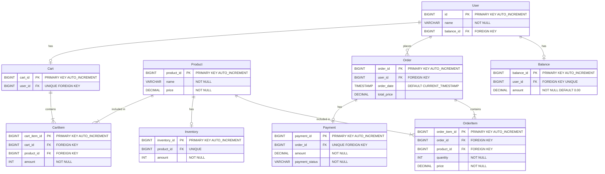

<h1>ERD</h1>

```mermaid
erDiagram
    User {
        BIGINT id PK "PRIMARY KEY AUTO_INCREMENT"
        VARCHAR name "NOT NULL"
        BIGINT balance_id FK "FOREIGN KEY"
    }
    Balance {
        BIGINT balance_id PK "PRIMARY KEY AUTO_INCREMENT"
        BIGINT user_id FK "FOREIGN KEY UNIQUE"
        DECIMAL amount "NOT NULL DEFAULT 0.00"
    }
    Product {
        BIGINT product_id PK "PRIMARY KEY AUTO_INCREMENT"
        VARCHAR name "NOT NULL"
        DECIMAL price "NOT NULL"
    }
    Order {
        BIGINT order_id PK "PRIMARY KEY AUTO_INCREMENT"
        BIGINT user_id FK "FOREIGN KEY"
        TIMESTAMP order_date "DEFAULT CURRENT_TIMESTAMP"
        DECIMAL total_price
    }
    OrderItem {
        BIGINT order_item_id PK "PRIMARY KEY AUTO_INCREMENT"
        BIGINT order_id FK "FOREIGN KEY"
        BIGINT product_id FK "FOREIGN KEY"
        INT quantity "NOT NULL"
        DECIMAL price "NOT NULL"
    }
    Inventory {
        BIGINT inventory_id PK "PRIMARY KEY AUTO_INCREMENT"
        BIGINT product_id FK "UNIQUE"
        INT amount "NOT NULL"
    }
    Payment {
        BIGINT payment_id PK "PRIMARY KEY AUTO_INCREMENT"
        BIGINT order_id FK "UNIQUE FOREIGN KEY"
        DECIMAL amount "NOT NULL"
        VARCHAR payment_status "NOT NULL"
    }
    Cart {
        BIGINT cart_id PK "PRIMARY KEY AUTO_INCREMENT"
        BIGINT user_id FK "UNIQUE FOREIGN KEY"
    }
    CartItem {
        BIGINT cart_item_id PK "PRIMARY KEY AUTO_INCREMENT"
        BIGINT cart_id FK "FOREIGN KEY"
        BIGINT product_id FK "FOREIGN KEY"
        INT amount "NOT NULL"
    }

    User ||--o| Balance: "has"
    User ||--o{ Order: "places"
    Order ||--|{ OrderItem: "contains"
    Order ||--o| Payment: "has"
    Product ||--|{ OrderItem: "included in"
    Product ||--o| Inventory: "has"
    User ||--o| Cart: "has"
    Cart ||--|{ CartItem: "contains"
    Product ||--|{ CartItem: "included in"
```